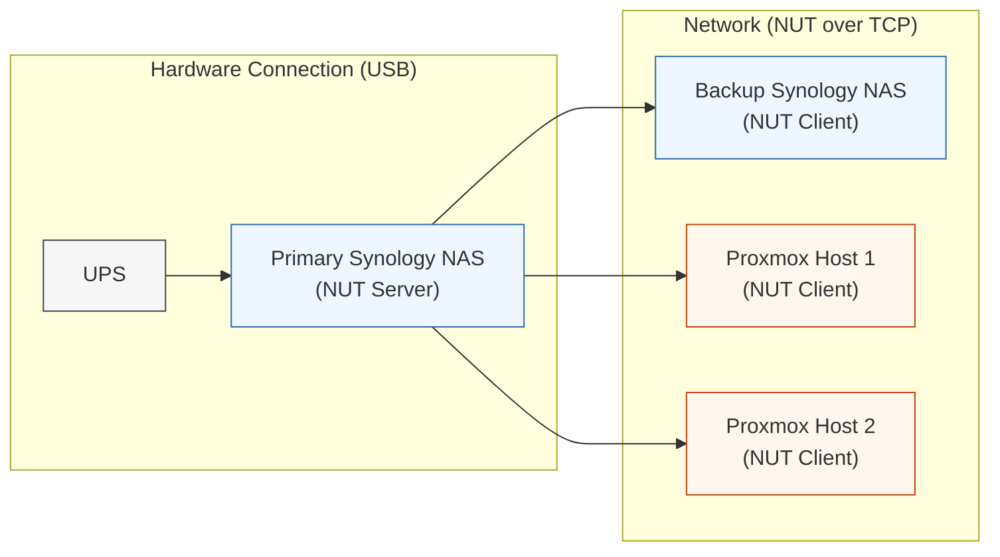

*Centralized UPS & NUT with Synology and Proxmox*

When designing your homelab, don't forget power management!  Your homelab is probably serving the majority of your files, backups, and applications, so losing it all due to a bad shutdown during a power loss is a huge problem.  This only compounds when your homelab takes over automation tasks, family-critical infrastructure, and AI workloads.

At a minimum, your primary server needs to be on an Uninterrupted Power Supply (UPS).  These systems have a large storage battery which is constantly getting topped up from your home's power source.  All of your protected devices are plugged into it.  Note that many UPS have specific power plug ports for battery-protected and surge-protected; the surge-protected ports just turn off during a power outage.

Once you have the UPS, you can keep everything running in a power outage situation, cleanly protecting your equipment during relatively short duration power outages or periods of low power (like a brownout).  Your next challenge is how to successfully and safely shutdown your equipment if a power outage goes longer than your UPS battery can maintain.

In this article, I will walk through how I implemented **centralized power management** using a single UPS, **Network UPS Tools (NUT)**, and my **Primary Synology NAS** as the authoritative power controller for my secondary devices, including:

- Second **Synology NAS**
- Two **Proxmox Nodes** 

This architecture ensures that when power fails:

1. The UPS detects the outage.
2. Synology coordinates shutdown order.
3. The dependent systems shut down safely.
4. The primary system shuts down safely.
5. Data integrity is preserved.

While an UPS can be expensive, getting one and setting up a power management architecture is one of the highest ROI upgrades you can make to a homelab.

---

## Architecture Overview

### High-Level Design

| Component            | Role                    |
| -------------------- | ----------------------- |
| UPS (USB-connected)  | Power source + battery  |
| Primary Synology NAS | **NUT Server (Master)** |
| Backup Synology NAS  | NUT Client              |
| Proxmox Node 1       | NUT Client              |
| Proxmox Node 2       | NUT Client              |

Only **one device talks directly to the UPS via USB**. Everything else listens over the network (which means your network switch needs to be on the UPS battery too!).

### System Diagram




---

## Why Centralized NUT Matters

Using a single authoritative NUT server provides:

- Known, deterministic shutdown order
- No race conditions between hosts
- No duplicate USB connections
- A single place to audit power events
- Clean recovery after power restoration

This becomes especially important once you introduce:

- Critical backups
- Virtual machines
- Containers
- Databases
- Agentic AI development
- CI/CD runners
- Automation stacks

---

## Step 1: Configure the UPS on the Primary Synology NAS (NUT Server)

### 1. Physically Connect the UPS and Primary Device

- Connect the UPS to the **Primary Synology NAS** via USB.  *This is usually a special cable provided with UPS at purchase, not a common USB-to-USB cable.*

- Power on the UPS.

### 2. Enable UPS Support on the Primary Synology NAS

1. Log in as an administrator account.
2. Open **Control Panel**
3. Navigate to **Hardware & Power → UPS**
4. Check **Enable UPS Support**
5. Set **USB UPS**
6. Enable **Network UPS Server**
7. Choose a shutdown delay (I recommend at **Low Power**)

### 3. Allow Client Access

- On the same menu, add the IP addresses of:
    
    - Backup NAS
    - Proxmox Node 1
    - Proxmox Node 2
    - Any other dependent systems

At this point, your Primary NAS is acting as a **NUT server**.  Synology makes this easy, and that ease of use is a key reason I stick with their products (if you want to learn more about why I pick Synology, check out my previous article on the [physical hardware in my homelab]()!).

---

## Step 2: Configure the Backup Synology NAS (First NUT Client)

### 1. Open UPS Settings

- **Control Panel → Hardware & Power → UPS**

### 2. Configure as Network Client

- Enable UPS support
- Select **Network UPS Server**
- Enter the IP address of the **Primary Synology NAS**

### 3. Test Connectivity

Once configured:

- DSM should report UPS status
- Battery percentage and load should appear

No credentials are required; Synology handles authentication internally.  Ease of use!

---

## Step 3: Install NUT on Proxmox Nodes (other NUT clients)

On **each Proxmox node**, install NUT as a client.  Jump into the shell.

```bash
apt update
apt install nut-client
```

---

## Step 4: Configure Proxmox as a NUT Client


Once the installation is complete, configure each node.
### 1. Edit NUT Mode

```bash
nano /etc/nut/nut.conf
```

Set:

```ini
MODE=netclient
```

---

### 2. Configure UPS Monitoring

```bash
nano /etc/nut/upsmon.conf
```

Add:

```ini
MONITOR ups@<PRIMARY_NAS_IP> 1 monuser secret secondary
```

Synology uses these settings 

- UPS name: `ups` 
- Username: `monuser`
- Password: `secret`

Optionally, you can set the NOTIFYFLAG settings so that you get notified when UPS events occur.  I set the following options just by uncommenting them.

```ini
NOTIFYFLAG ONBATT SYSLOG+WALL
NOTIFYFLAG LOWBATT SYSLOG+WALL
```

The `upsmon.conf` is very easy to follow, so read through the other options, and uncomment the ones that make sense to you.  

---

### 3. Enable Services

To start up the nut-client, run:

```bash
systemctl enable nut-monitor
systemctl start nut-monitor
```

Repeat on **both Proxmox nodes**.

---

## Step 5: Validate End-to-End Shutdown

First, validate you've got a solid connection on your ProxMox nodes.  The command below will show you the information about your UPS as provided by your NUT server.

```bash
upsc ups@<PRIMARY_NAS_IP>
```

---

## Step 6: Recommended Test Procedure

After you've validated the various servers are communicating with each other, and you've checked that your **network switch** is also connected to the UPS, you're ready to run a complete test of your power management architecture.  Here's how:

1. Ensure no critical writes or other operations are in progress.
2. Pull power from the UPS.
3. Observe:
    - UPS switches to battery
    - Synology logs power event
    - Proxmox nodes receive shutdown signal
    - Backup NAS shuts down cleanly
    - Receive your selected notifications.
4. Restore power.
5. Confirm all systems boot normally.

If everything shuts down gracefully, your configuration is correct.

---

## How It Works: Shutdown Order

1. UPS detects power loss
2. Primary Synology receives USB event
3. NUT broadcasts `OB (on battery)` and later `LB (low battery)`
4. Proxmox nodes shut down VMs first
5. Proxmox hosts shut down
6. Backup NAS shuts down
7. Primary NAS shuts down last

This order prevents:

- VM corruption
- NFS/SMB lockups
- Incomplete snapshots
- Filesystem journal issues
- Many other issues


---

## Lessons Learned

- If you've got multiple devices on a single UPS, a centralized NUT server is vastly more reliable than per-device USB UPS connections.
- Networking gear enabling the NUT connections **MUST** be on battery-powered UPS outlets to maintain connectivity during a power outage.
- A Synology NAS makes an excellent NUT server with minimal configuration.  It just works.
- Proxmox integrates cleanly once NUT is treated as infrastructure, not an afterthought.
- Power events are far more common than hardware failures.  At least where I live.
- And while we'll cover it in another article, setting up power management like this is very simple in Ansible, ensuring a consistent and predictable automated set up for additional servers.

---

## Final Thoughts

What got me to this setup?  Easy: a power outage.  While I had prepared in advance for my Primary and Secondary NAS, I had failed to properly set up my ProxMox nodes.  After the outage, I was lucky that everything came back without a hitch.  If it had happened during my backup window, I likely would have had a lot of problems recovering.

Anyway, this setup has transformed power failures into a **non-event**. Everything shuts down cleanly, comes back exactly as expected, and preserves data integrity.  Much less stress.

If you're running **virtualization, containers, automation, or AI workloads at home**, power management is not optional (learn more about my [homelab's many purposes here]()).  Build it into your homelab's architecture early.  The time it takes to set up is far less than having to restore everything after a major failure.

If you're serious about putting together your own homelab or just want to follow along with future deep dives, follow me here on *The Curiosity Stack*!